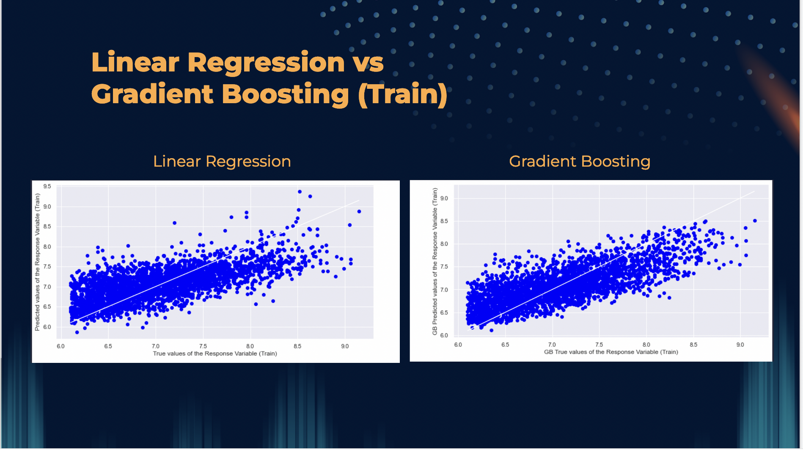
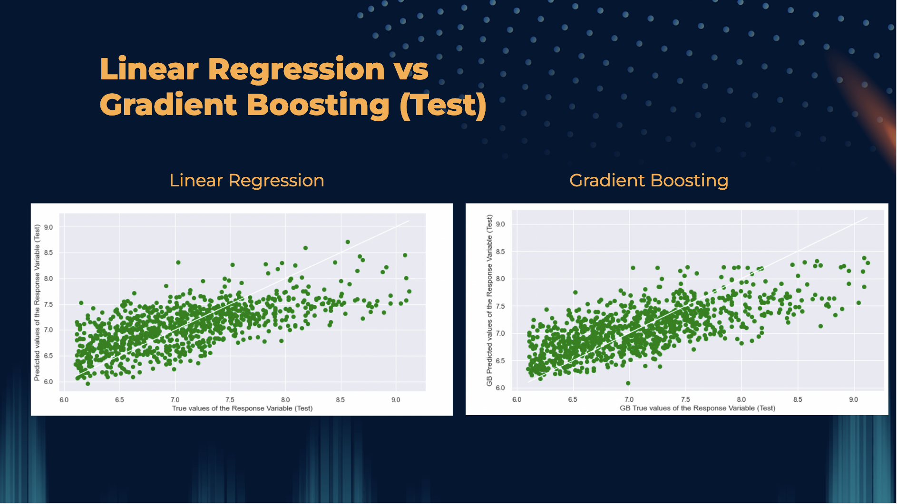
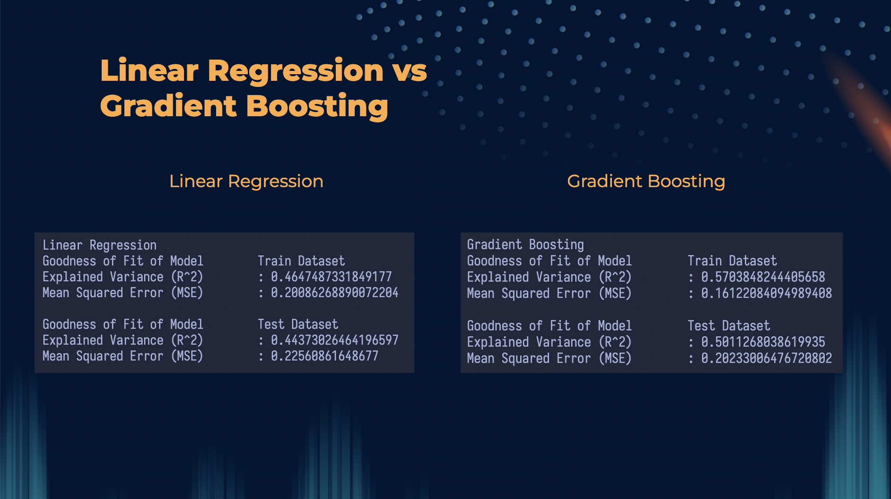
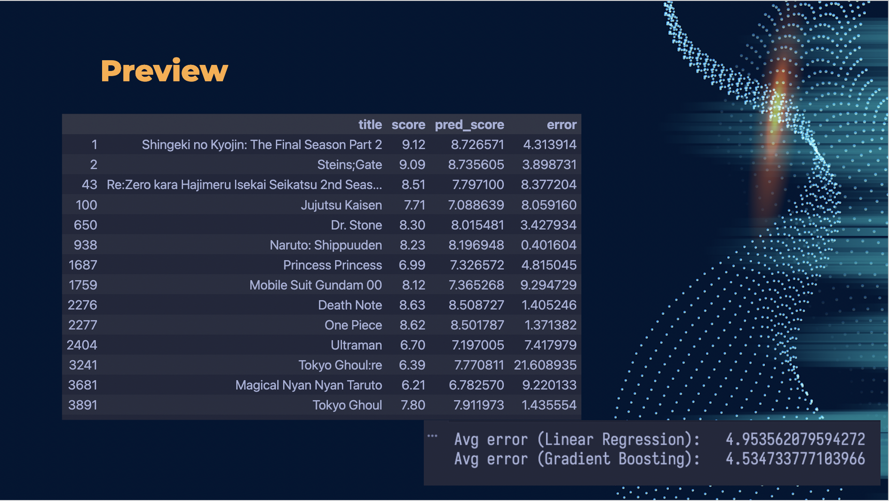

# `SC1015 Intro to DSAI Assignment AY2021-2022`

## Tutorial Group
> SC1, Friday 1330-1530

## Team Members
| Name           | Matric #  |                                  Participation |
| :------------- | :-------: | ---------------------------------------------: |
| Soh Wee Kiat   | U2121644F | Web Scraping, Presentation, Video Edit, README |
| Samuel Chua    | U2122421B |      EDA + Data Cleaning, Presentation, README |
| Budi Syahiddin | U2120429A |         Machine Learning, Presentation, README |

## Roadmap
- [x] Data scraping from myanimelist
- [x] Data cleaning
- [x] Exploratory Analysis 
- [x] Machine Learning
- [x] Visualisation
- [x] Presentation Video

## How to navigate the files?
- Exploratory Analysis folder: EDA, data cleaning etc
- MachineLearning: Linear Regression and Gradient Boosting 
- WebScraping: Web scraping scripts
- data: `anime_cleaned.csv`, `anime_full.csv`

## Scraper details
There isn't any publicly available API for myanimelist, so we have to scrape them.
and since scraping is mostly an I/O bound task, python will be used for simplicity.

## Data Cleaning
- Removed all non-anime types (OVA, MUSIC, MOVIE, SPECIALS) including one episode ONAs (considered MOVIE)
- Converted all blank categorical data to unknown
- Converted premier date to premier season (E.g Winter 1987 to Winter)
- Converted broadcast timings to broadcast date (E.g Friday 18:00 to Friday)
- Converted duration of episodes to standardised in minutes
- Converted unknown durations to mean (21 minutes)
- Converted blank demographics to "All"
- Converted aired date to year aired (E.g Apr 2012 to 2012)
- Added main genre from genre (E.g Action, Adventure, Romance to Action)

## Exploratory Analysis
- Checked number of rows after data cleaning with `data.shape`
    - Number of rows after cleaning is 3958 from 8200
- Checked number of predictors with `data.info()`
    - Number of numerical predictors - 5 
    - Number of categorical predictors - 8 
- Analysed Numerical Predictors to find relationship with score using boxplot, violinplot, histogram and correlation matrix
    - Best predictor is popularity with correlation of -0.55 with score
    - Worst predictor is epsiode with correlation of 0.02 with score
- Analysed Categorical Predictors with bivariate visualisation using boxplot and strip plot
    - Most predictor have slight positive relationship with score or neutral relationship
    - Most predictors have very imbalanced count of datas with a few values having a lot more count than the rest

## Machine Learning
In this project we have used 2 machine learning algorithms, namely linear regression and gradient boosting.
Why did we choose these 2 algorithms?

- Linear Regression => Familiarity, since we have used it in our labs
- Gradient Boosting => Something that is out of the syllabus, and it seems quite simple to create a pipeline together with linear regression

For Gradient boosting, we used [`GradientBoostingRegressor()`](https://scikit-learn.org/stable/modules/generated/sklearn.ensemble.GradientBoostingRegressor.html) and for [`LinearRegression()`](https://scikit-learn.org/stable/modules/generated/sklearn.linear_model.LinearRegression.html)

### Data encoding 
We have to encode some data for example
- source
- main genre
- demographics
- etc

Since these data are categorical, we used [`OrdinalEncoder`](https://scikit-learn.org/stable/modules/generated/sklearn.preprocessing.OrdinalEncoder.html) and [`OneHotEncoder`](https://scikit-learn.org/stable/modules/generated/sklearn.preprocessing.OneHotEncoder.html)

## Results
> Train Set

> Test Set

> Explained Variance and MSE

> Preview of predictions

## References
- [scikit-learn docs](https://scikit-learn.org/stable/getting_started.html)
- [Guide to Encoding Categorical Features Using Scikit-Learn For Machine Learning](https://towardsdatascience.com/guide-to-encoding-categorical-features-using-scikit-learn-for-machine-learning-5048997a5c79)
